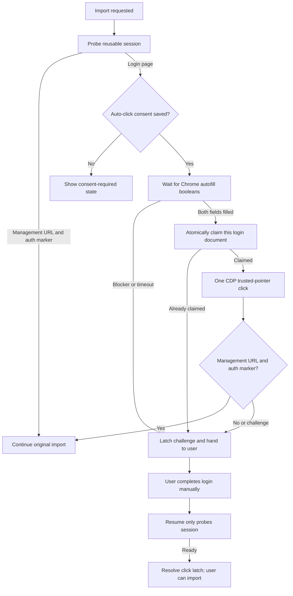

# Coupang Eats Chrome Password Manager Login Implementation Plan

> **For agentic workers:** REQUIRED SUB-SKILL: Use superpowers:subagent-driven-development (recommended) or superpowers:executing-plans to implement this plan task-by-task. Steps use checkbox (`- [ ]`) syntax for tracking.

**Goal:** Reuse a fixed real-Google-Chrome profile for Coupang Eats, let Chrome own and autofill credentials, click the login button at most once only after explicit user consent, verify the authenticated management screen, and then continue the originally requested catalog import without exposing credential values to the app.

**Architecture:** Add `managed_password_manager_login` as a plugin authentication strategy instead of forcing Coupang Eats through the existing app credential vault. A privacy-preserving page probe returns only form-presence, filled-state, blocker, and management-marker booleans. A generic password-manager coordinator waits for autofill, atomically claims one trusted-input click, verifies both the management URL and authenticated-page evidence, and returns `ready` to the existing session orchestrator so the same import call continues. CAPTCHA, OTP, login errors, Chrome/Windows unlock prompts, account selection, or any unconfirmed outcome latch the session for manual action and never trigger an automatic retry.

**Tech Stack:** Electron, TypeScript, real Google Chrome with a persistent user-data directory, Chrome DevTools Protocol, node:sqlite, Zod, React, Vitest

## Global Constraints

- Use the installed Google Chrome binary and the stable profile directory `join(app.getPath('userData'), 'managed-chrome')`; do not use Playwright Chromium, an incognito context, or a temporary profile for this flow.
- Chrome Password Manager is the only owner of the Coupang Eats username and password. Do not copy Chrome credentials into `CredentialVault`, IPC payloads, page snapshots, logs, errors, or database rows.
- The page realm may reduce each input to one boolean (`value !== ''` or `:-webkit-autofill`). It must never return the value, its length, a prefix, a hash, or any other credential-derived data to Node.
- Default automatic login-button consent to `false`. Store the user's explicit per-platform choice and the time it changed.
- Reuse an already-authenticated session before opening the login page or inspecting autofill.
- Use CDP `Input.dispatchMouseEvent`; do not call `HTMLElement.click()`, dispatch a synthetic DOM click, submit the form, press Enter, or mutate either input.
- One login document may claim exactly one automatic click. Concurrent imports, app restarts, timeouts, and repeated `connect` calls must not create another click while an attempt is unresolved.
- Polling for autofill and polling for post-click success are observation, not login retry. `mousePressed` and `mouseReleased` may each occur once only.
- Success requires both a Coupang Eats `/merchant/management` URL and authenticated page evidence (`logoutMarkerDetected` or `managementMarkerDetected`) with no visible password input.
- Login error, CAPTCHA, OTP, account selection, Chrome Password Manager unlock, Windows Hello/unlock, missing autofill, or an unconfirmed post-click result becomes `challenge_required`. After that, `resumeAfterUserAction` only probes session state; it never clicks.
- Chrome-owned UI cannot be inspected through page DOM/CDP. If autofill does not appear before the bounded timeout, report `password_manager_unlock_or_account_selection_required` and hand control to the user.
- Do not automatically delete or decrypt a legacy encrypted Coupang Eats entry. Stop reading it in every Coupang path and offer a separate explicit cleanup action that deletes the encrypted envelope without decrypting it.
- Keep Baemin, Yogiyo, Ddangyo, Delivery Special, and Naver behavior unchanged.
- Never stage unrelated files from the existing dirty worktree.

---

## State Flow



## File Map

- `src/shared/platform-capabilities.ts`: add the password-manager strategy and declare it for Coupang Eats.
- `src/shared/contracts.ts`: add the auth-preference DTO, non-secret login-attempt states, and browser readiness fields.
- `src/main/db/migrations.ts`: create auth preference and one-click attempt tables plus the unresolved-attempt unique index.
- `src/main/repositories/platform-auth-preference-repository.ts`: persist explicit consent.
- `src/main/repositories/platform-login-click-attempt-repository.ts`: atomically claim and resolve one-click attempts.
- `src/main/platforms/base/plugin.ts`: expose an optional credential-free password-manager auth operation.
- `src/main/platforms/coupangeats/password-manager-login-descriptor.ts`: hold Coupang URLs, selectors, and blocker markers.
- `src/main/services/managed-chrome-login-page-probe.ts`: inspect only booleans and document identity.
- `src/main/services/managed-password-manager-login-coordinator.ts`: execute the consent, autofill, one-click, verification, and handoff flow.
- `src/main/services/managed-chrome-script-runner.ts`: expose CDP document identity and retain trusted pointer input.
- `src/main/services/managed-chrome-launcher.ts`: assert real Google Chrome and the persistent profile are usable for password-manager login.
- `src/main/services/browser-platform-auth-driver.ts`: route credential-free password-manager login through the coordinator.
- `src/main/services/platform-session-strategy.ts`: validate the new strategy order.
- `src/main/services/platform-session-orchestrator.ts`: execute the new strategy and resolve its attempt latch when any probe becomes ready.
- `src/main/services/managed-chrome-login-automator.ts`: remove Coupang Eats from the legacy app-credential form-filling path.
- `src/main/index.ts`: compose repositories, coordinator, descriptor, driver, and orchestrator.
- `src/main/ipc/register-handlers.ts`: expose preference and legacy-credential cleanup APIs; let Coupang imports bypass the app credential gate.
- `src/main/preload.ts`, `src/renderer/src/lib/api.ts`: expose typed preference and cleanup calls.
- `src/renderer/src/pages/SettingsPage.tsx`: replace Coupang credential inputs with first-run instructions and explicit consent.
- `src/main/services/cli-task-runner.ts`: let Coupang imports use the browser session strategy without an app credential.
- `README.md`, `docs/current-status.md`: document the operator flow and its manual handoff boundaries after verification.

### Task 1: Declare the Credential-Free Authentication Contract

**Files:**
- Modify: `src/shared/platform-capabilities.ts`
- Modify: `src/shared/contracts.ts`
- Modify: `src/main/platforms/base/plugin.ts`
- Modify: `src/main/services/platform-session-strategy.ts`
- Test: `tests/unit/shared/platform-capabilities.test.ts`
- Test: `tests/unit/main/platform-session-strategy.test.ts`

**Interfaces:**
- Consumes: existing `PlatformAuthStrategy`, `PlatformAuthProbe`, and `PlatformAuthDriver`.
- Produces: `managed_password_manager_login`, `PlatformAuthPreferenceRecord`, `authenticateWithPasswordManager()`.

- [ ] **Step 1: Write the failing capability tests**

```ts
it('uses Chrome Password Manager instead of app credentials for Coupang Eats', () => {
  expect(PLATFORM_CAPABILITIES.coupangeats.authentication.strategies).toEqual([
    'reuse_managed_session',
    'reuse_extension_session',
    'managed_password_manager_login',
    'manual_authentication'
  ])
  expect(PLATFORM_CAPABILITIES.coupangeats.authentication.strategies).not.toContain(
    'managed_credential_login'
  )
})

it('accepts password-manager login only after reusable session strategies', () => {
  expect(validatePlatformSessionStrategyOrder([
    'reuse_managed_session',
    'reuse_extension_session',
    'managed_password_manager_login',
    'manual_authentication'
  ])).toHaveLength(4)
})
```

- [ ] **Step 2: Run the focused tests and confirm the new strategy is rejected**

Run: `npx vitest run tests/unit/shared/platform-capabilities.test.ts tests/unit/main/platform-session-strategy.test.ts`

Expected: FAIL because `managed_password_manager_login` is not in `PlatformAuthStrategy` and Coupang Eats still uses `reusableManualStrategies`.

- [ ] **Step 3: Add the exact shared contracts**

```ts
export type PlatformAuthStrategy =
  | 'official_api'
  | 'reuse_managed_session'
  | 'reuse_extension_session'
  | 'embedded_credential_login'
  | 'managed_credential_login'
  | 'managed_password_manager_login'
  | 'manual_authentication'

export interface PlatformAuthPreferenceRecord {
  workspaceId: string
  platformCode: PlatformCode
  autoClickLoginButtonConsented: boolean
  consentUpdatedAt: string | null
  updatedAt?: string
}

export interface PlatformAuthDriver {
  probe(): Promise<PlatformAuthProbe>
  submitCredential?(credential: PlatformCredential): Promise<PlatformAuthProbe>
  authenticateWithPasswordManager?(): Promise<PlatformAuthProbe>
  openUserChallenge?(): Promise<void>
}
```

Add the new strategy to the credential-stage ordering set in `platform-session-strategy.ts`, but not to the set that reads `CredentialVault`.

- [ ] **Step 4: Declare the Coupang strategy order explicitly**

Use the four-strategy array from Step 1. Do not add this strategy to another platform yet.

- [ ] **Step 5: Re-run the focused tests**

Run: `npx vitest run tests/unit/shared/platform-capabilities.test.ts tests/unit/main/platform-session-strategy.test.ts`

Expected: PASS.

- [ ] **Step 6: Commit only Task 1 files**

```bash
git add src/shared/platform-capabilities.ts src/shared/contracts.ts src/main/platforms/base/plugin.ts src/main/services/platform-session-strategy.ts tests/unit/shared/platform-capabilities.test.ts tests/unit/main/platform-session-strategy.test.ts
git commit -m "feat(auth): declare password manager login strategy"
```

### Task 2: Persist Consent and an Atomic One-Click Latch

**Files:**
- Modify: `src/main/db/migrations.ts`
- Create: `src/main/repositories/platform-auth-preference-repository.ts`
- Create: `src/main/repositories/platform-login-click-attempt-repository.ts`
- Create: `tests/unit/main/platform-auth-preference-repository.test.ts`
- Create: `tests/unit/main/platform-login-click-attempt-repository.test.ts`

**Data model:**

```sql
create table if not exists platform_auth_preferences (
  workspace_id text not null,
  platform_code text not null,
  auto_click_login_button_consented integer not null default 0,
  consent_updated_at text,
  updated_at text not null default current_timestamp,
  primary key (workspace_id, platform_code)
);

create table if not exists platform_login_click_attempts (
  attempt_id text primary key,
  workspace_id text not null,
  platform_code text not null,
  document_key_hash text not null,
  state text not null,
  attempted_at text not null,
  resolved_at text
);

create unique index if not exists idx_platform_login_click_attempts_unresolved
  on platform_login_click_attempts (workspace_id, platform_code)
  where state in ('claimed', 'submitted', 'handed_off');
```

- [ ] **Step 1: Write failing preference tests**

```ts
it('defaults auto-click consent to false', () => {
  expect(repository.get('default', 'coupangeats')).toMatchObject({
    platformCode: 'coupangeats',
    autoClickLoginButtonConsented: false,
    consentUpdatedAt: null
  })
})

it('records explicit opt-in and opt-out timestamps', () => {
  repository.setAutoClickConsent('default', 'coupangeats', true, '2026-07-26T10:00:00.000Z')
  expect(repository.get('default', 'coupangeats')).toMatchObject({
    autoClickLoginButtonConsented: true,
    consentUpdatedAt: '2026-07-26T10:00:00.000Z'
  })
})
```

- [ ] **Step 2: Write failing click-latch tests**

```ts
it('allows only one unresolved click claim for a platform', () => {
  expect(repository.claim({
    attemptId: 'attempt-1',
    workspaceId: 'default',
    platformCode: 'coupangeats',
    documentKeyHash: 'document-a',
    attemptedAt: '2026-07-26T10:00:00.000Z'
  })).toBe(true)
  expect(repository.claim({
    attemptId: 'attempt-2',
    workspaceId: 'default',
    platformCode: 'coupangeats',
    documentKeyHash: 'document-a',
    attemptedAt: '2026-07-26T10:00:01.000Z'
  })).toBe(false)
})

it('allows a later genuine expiry after the prior attempt is resolved ready', () => {
  repository.markState('attempt-1', 'succeeded', '2026-07-26T10:00:05.000Z')
  expect(repository.claim({
    attemptId: 'attempt-2',
    workspaceId: 'default',
    platformCode: 'coupangeats',
    documentKeyHash: 'document-b',
    attemptedAt: '2026-08-26T10:00:00.000Z'
  })).toBe(true)
})
```

- [ ] **Step 3: Run repository tests and verify missing-table failures**

Run: `npx vitest run tests/unit/main/platform-auth-preference-repository.test.ts tests/unit/main/platform-login-click-attempt-repository.test.ts`

Expected: FAIL because both repositories and tables are missing.

- [ ] **Step 4: Implement typed repositories without secret-shaped columns**

`PlatformAuthPreferenceRepository` must expose `get`, `list`, and `setAutoClickConsent`. `get` returns an in-memory default record when no row exists.

`PlatformLoginClickAttemptRepository` must expose:

```ts
type LoginClickAttemptState = 'claimed' | 'submitted' | 'succeeded' | 'handed_off'

claim(input: LoginClickAttemptClaim): boolean
markState(attemptId: string, state: Exclude<LoginClickAttemptState, 'claimed'>, at: string): void
markPlatformReady(workspaceId: string, platformCode: PlatformCode, at: string): void
getUnresolved(workspaceId: string, platformCode: PlatformCode): PlatformLoginClickAttemptRecord | null
```

Implement `claim` with `insert or ignore` and return `result.changes === 1`. Never store a tab URL, form data, credential revision, or input metadata in this table.

- [ ] **Step 5: Add a serialization privacy assertion**

```ts
expect(JSON.stringify(repository.getUnresolved('default', 'coupangeats')))
  .not.toMatch(/username|password|credential|cookie|token|authorization/i)
```

- [ ] **Step 6: Re-run repository tests**

Run: `npx vitest run tests/unit/main/platform-auth-preference-repository.test.ts tests/unit/main/platform-login-click-attempt-repository.test.ts`

Expected: PASS.

- [ ] **Step 7: Commit only Task 2 files**

```bash
git add src/main/db/migrations.ts src/main/repositories/platform-auth-preference-repository.ts src/main/repositories/platform-login-click-attempt-repository.ts tests/unit/main/platform-auth-preference-repository.test.ts tests/unit/main/platform-login-click-attempt-repository.test.ts
git commit -m "feat(auth): persist consent and one-click latch"
```

### Task 3: Establish Real-Chrome and Trusted-Input Primitives

**Files:**
- Modify: `src/shared/contracts.ts`
- Modify: `src/main/services/managed-chrome-launcher.ts`
- Modify: `src/main/services/managed-chrome-script-runner.ts`
- Test: `tests/unit/main/managed-chrome-launcher.test.ts`
- Test: `tests/unit/main/managed-chrome-script-runner.test.ts`

**Interfaces:**

```ts
interface BrowserInspectorStatus {
  // existing fields
  passwordManagerLoginReady?: boolean
}

interface ManagedChromeDocumentIdentity {
  tabId: string
  loaderId: string
}
```

- [ ] **Step 1: Write a failing launcher test for real Google Chrome and a stable profile**

```ts
it('marks password-manager login ready only for Google Chrome with the fixed profile', () => {
  const status = launcher.getStatus()
  expect(status.chromePath).toBe('C:\\Program Files\\Google\\Chrome\\Application\\chrome.exe')
  expect(status.chromeProfilePath).toBe('C:\\AppData\\delivery-menu-sync\\managed-chrome')
  expect(status.passwordManagerLoginReady).toBe(true)
})
```

Add a negative case for a Chromium executable and for an empty profile path. `launch()` must continue to use `--user-data-dir=<fixed path>` and must not add `--incognito`, `--guest`, `--disable-password-manager`, or a temporary directory.

- [ ] **Step 2: Write a failing document-identity and trusted-click test**

```ts
it('returns the top-frame loader id without evaluating page fields', async () => {
  await expect(runner.getDocumentIdentity('tab-1')).resolves.toEqual({
    tabId: 'tab-1',
    loaderId: 'loader-7'
  })
  expect(sentCommands).toContainEqual(expect.objectContaining({ method: 'Page.getFrameTree' }))
})

it('dispatches one press and one release without a DOM click', async () => {
  await runner.clickSelector('tab-1', 'button[type="submit"]')
  expect(methods.filter((method) => method === 'Input.dispatchMouseEvent')).toEqual([
    'Input.dispatchMouseEvent',
    'Input.dispatchMouseEvent',
    'Input.dispatchMouseEvent'
  ])
  expect(expressions.join('\n')).not.toMatch(/\.click\s*\(|dispatchEvent|requestSubmit|\.submit\s*\(/)
})
```

- [ ] **Step 3: Run focused tests**

Run: `npx vitest run tests/unit/main/managed-chrome-launcher.test.ts tests/unit/main/managed-chrome-script-runner.test.ts`

Expected: FAIL because readiness and document identity do not exist.

- [ ] **Step 4: Implement readiness and `Page.getFrameTree` support**

Add `getDocumentIdentity(tabId)` to `ManagedChromeScriptRunner`. Use the top frame's CDP `loaderId`; do not use DOM state, URL text, or input values as identity. The coordinator will hash `${tabId}\0${loaderId}` with SHA-256 before persistence.

Keep `clickSelector` as coordinate lookup followed by exactly one `mouseMoved`, one `mousePressed` with `clickCount: 1`, and one `mouseReleased` with `clickCount: 1`.

- [ ] **Step 5: Re-run focused tests**

Run: `npx vitest run tests/unit/main/managed-chrome-launcher.test.ts tests/unit/main/managed-chrome-script-runner.test.ts`

Expected: PASS.

- [ ] **Step 6: Commit only Task 3 files**

```bash
git add src/shared/contracts.ts src/main/services/managed-chrome-launcher.ts src/main/services/managed-chrome-script-runner.ts tests/unit/main/managed-chrome-launcher.test.ts tests/unit/main/managed-chrome-script-runner.test.ts
git commit -m "feat(chrome): add password manager login primitives"
```

### Task 4: Build a Boolean-Only Coupang Login Page Probe

**Files:**
- Create: `src/main/platforms/coupangeats/password-manager-login-descriptor.ts`
- Create: `src/main/services/managed-chrome-login-page-probe.ts`
- Create: `tests/unit/main/managed-chrome-login-page-probe.test.ts`
- Modify: `src/main/platforms/coupangeats/selectors.ts`

**Probe result:**

```ts
export type ManagedChromeLoginBlocker =
  | 'login_error'
  | 'captcha'
  | 'otp'
  | 'account_selection'

export interface ManagedChromeLoginPageEvidence {
  loginFormVisible: boolean
  usernameFilled: boolean
  passwordFilled: boolean
  submitVisible: boolean
  submitEnabled: boolean
  blocker: ManagedChromeLoginBlocker | null
  managementMarkerDetected: boolean
  logoutMarkerDetected: boolean
  visiblePasswordInputCount: number
}
```

- [ ] **Step 1: Write failing JSDOM tests for presence-only evidence**

```ts
it('returns only booleans when Chrome has filled both fields', () => {
  document.body.innerHTML = `
    <input id="loginId" value="merchant-owner" />
    <input id="password" type="password" value="secret-value" />
    <button type="submit">로그인</button>
  `
  const evidence = collectManagedChromeLoginPageEvidence(document, location.href, descriptor)
  expect(evidence).toMatchObject({
    usernameFilled: true,
    passwordFilled: true,
    submitVisible: true,
    submitEnabled: true,
    blocker: null
  })
  expect(JSON.stringify(evidence)).not.toMatch(/merchant-owner|secret-value/)
  expect(Object.keys(evidence)).not.toContain('username')
  expect(Object.keys(evidence)).not.toContain('password')
})
```

- [ ] **Step 2: Add failing blocker tests**

Cover these exact outputs:

- visible credential failure text or `/merchant/login/error` -> `login_error`
- visible CAPTCHA iframe, `[data-sitekey]`, `보안문자`, or `자동입력방지` -> `captcha`
- `autocomplete="one-time-code"` with authentication-number text -> `otp`
- `계정 선택`, `로그인할 계정`, or `Choose an account` -> `account_selection`

Each blocker test must assert `submitEnabled` does not authorize a click when `blocker` is non-null.

- [ ] **Step 3: Run the probe test**

Run: `npx vitest run tests/unit/main/managed-chrome-login-page-probe.test.ts`

Expected: FAIL because the probe and descriptor are missing.

- [ ] **Step 4: Implement the descriptor and in-page reduction**

The Coupang descriptor must contain:

```ts
export const coupangEatsPasswordManagerLoginDescriptor = {
  platformCode: 'coupangeats',
  loginUrl: 'https://store.coupangeats.com/merchant/login',
  loginPathPattern: /^\/merchant\/login(?:\/|$)/,
  managementPathPattern: /^\/merchant\/management(?:\/|$)/,
  usernameSelector: '#loginId',
  passwordSelector: '#password',
  submitSelector: 'button[type="submit"]'
} as const
```

Within the browser expression, reduce an input immediately to `Boolean(input.matches(':-webkit-autofill') || input.value !== '')`. Return only the `ManagedChromeLoginPageEvidence` object. Never include the input object, `value`, `value.length`, text fragments from the input, or a serialized form.

- [ ] **Step 5: Re-run and add a source-level privacy assertion**

Run: `npx vitest run tests/unit/main/managed-chrome-login-page-probe.test.ts`

Expected: PASS. The test must also inspect the generated expression and assert that it contains no `Runtime.getProperties`, form serialization, or credential logging.

- [ ] **Step 6: Commit only Task 4 files**

```bash
git add src/main/platforms/coupangeats/password-manager-login-descriptor.ts src/main/platforms/coupangeats/selectors.ts src/main/services/managed-chrome-login-page-probe.ts tests/unit/main/managed-chrome-login-page-probe.test.ts
git commit -m "feat(coupangeats): inspect chrome autofill without exposing values"
```

### Task 5: Coordinate Autofill, One Trusted Click, Verification, and Handoff

**Files:**
- Create: `src/main/services/managed-password-manager-login-coordinator.ts`
- Create: `tests/unit/main/managed-password-manager-login-coordinator.test.ts`

**Coordinator contract:**

```ts
interface ManagedPasswordManagerLoginCoordinator {
  connect(platformCode: PlatformCode): Promise<PlatformAuthProbe>
  markSessionReady(platformCode: PlatformCode): void
}
```

The coordinator inspects `ManagedChromeSessionProbe` and `ManagedChromeAuthEvidenceProbe` directly; it must not call back into `BrowserPlatformAuthDriver`, because that driver delegates password-manager authentication to this coordinator. Its private `inspectVerifiedManagementSession` helper requires the management path, a logout/management marker, and zero visible password inputs.

Use injected `sleep`, `now`, `randomUUID`, `autofillPollAttempts`, `autofillPollIntervalMs`, `verificationPollAttempts`, and `verificationPollIntervalMs` so every branch is deterministic in tests. Production defaults may poll autofill for 10 seconds and success for 15 seconds; neither loop may call the click method more than once.

- [ ] **Step 1: Write the reused-session and consent tests**

```ts
it('returns ready without launching or inspecting credentials when the session is valid', async () => {
  sessionProbe.inspect.mockResolvedValue(managementSession)
  authEvidenceProbe.inspect.mockResolvedValue({
    visiblePasswordInputCount: 0,
    loginMarkerDetected: false,
    credentialRejectionMarkerDetected: false,
    logoutMarkerDetected: true,
    managementMarkerDetected: true
  })
  await expect(coordinator.connect('coupangeats')).resolves.toMatchObject({ state: 'ready' })
  expect(launcher.launch).not.toHaveBeenCalled()
  expect(loginPageProbe.inspect).not.toHaveBeenCalled()
  expect(scriptRunner.clickSelector).not.toHaveBeenCalled()
})

it('does not click without saved explicit consent', async () => {
  preferences.get.mockReturnValue({
    workspaceId: 'default',
    platformCode: 'coupangeats',
    autoClickLoginButtonConsented: false,
    consentUpdatedAt: null
  })
  await expect(coordinator.connect('coupangeats')).resolves.toEqual({
    state: 'expired',
    detailCode: 'password_manager_auto_click_consent_required'
  })
  expect(scriptRunner.clickSelector).not.toHaveBeenCalled()
})
```

- [ ] **Step 2: Write the success and exactly-once tests**

```ts
it('clicks once after autofill and returns ready only after URL plus marker verification', async () => {
  loginPageProbe.inspect
    .mockResolvedValueOnce(filledLoginEvidence)
    .mockResolvedValueOnce({ ...managementEvidence, managementMarkerDetected: true })
  sessionProbe.inspect
    .mockResolvedValueOnce(loginSession)
    .mockResolvedValueOnce(managementSession)

  await expect(coordinator.connect('coupangeats')).resolves.toEqual({
    state: 'ready',
    detailCode: 'password_manager_login_verified'
  })
  expect(clickAttempts.claim).toHaveBeenCalledTimes(1)
  expect(scriptRunner.clickSelector).toHaveBeenCalledTimes(1)
  expect(scriptRunner.clickSelector).toHaveBeenCalledWith('login-tab', 'button[type="submit"]')
})

it('does not click twice when two imports connect concurrently', async () => {
  clickAttempts.claim.mockReturnValueOnce(true).mockReturnValueOnce(false)
  await Promise.all([coordinator.connect('coupangeats'), coordinator.connect('coupangeats')])
  expect(scriptRunner.clickSelector).toHaveBeenCalledTimes(1)
})
```

- [ ] **Step 3: Write every handoff test before implementation**

Assert no click and these detail codes:

| Evidence | Result detail code |
|---|---|
| `login_error` | `managed_login_rejected` |
| `captcha` | `captcha_required` |
| `otp` | `otp_required` |
| `account_selection` | `account_selection_required` |
| autofill timeout or inaccessible Chrome/Windows prompt | `password_manager_unlock_or_account_selection_required` |
| Chrome not ready for fixed-profile password manager | `google_chrome_profile_required` |
| unresolved atomic claim | `login_click_already_attempted` |
| post-click timeout | `password_manager_login_not_confirmed` |

All rows except missing consent return `challenge_required` and never retry automatically. A post-click failure marks the claimed attempt `handed_off`; a pre-click blocker is latched by the persisted challenge state without creating a fake click attempt.

- [ ] **Step 4: Run the coordinator test and confirm the module is missing**

Run: `npx vitest run tests/unit/main/managed-password-manager-login-coordinator.test.ts`

Expected: FAIL.

- [ ] **Step 5: Implement the state machine in this order**

1. Probe a reusable session and return immediately if ready.
2. Verify `passwordManagerLoginReady` and saved consent.
3. Launch the descriptor login URL in the fixed profile.
4. Find the login tab and poll boolean-only evidence.
5. Stop on any blocker before considering filled fields.
6. Require both filled booleans plus a visible, enabled submit control.
7. Fetch `{tabId, loaderId}`, hash it in Node, and atomically claim the click.
8. Call `clickSelector` once and mark the attempt `submitted`.
9. Poll without clicking. Require a management-path tab plus logout/management evidence and zero visible password inputs.
10. Mark `succeeded` and return `ready`, or mark `handed_off` and return a challenge.

- [ ] **Step 6: Verify resume never clicks**

Add a test that calls `markSessionReady` after a simulated manual login and asserts it resolves the outstanding row without invoking launcher, page probe, or click. The session orchestrator's `resumeAfterUserAction` remains a probe-only operation.

- [ ] **Step 7: Re-run the coordinator test**

Run: `npx vitest run tests/unit/main/managed-password-manager-login-coordinator.test.ts`

Expected: PASS.

- [ ] **Step 8: Commit only Task 5 files**

```bash
git add src/main/services/managed-password-manager-login-coordinator.ts tests/unit/main/managed-password-manager-login-coordinator.test.ts
git commit -m "feat(coupangeats): coordinate one-click chrome login"
```

### Task 6: Route Coupang Through the Plugin and Remove Legacy Credential Autofill

**Files:**
- Modify: `src/main/services/browser-platform-auth-driver.ts`
- Modify: `src/main/services/platform-session-orchestrator.ts`
- Modify: `src/main/services/managed-chrome-login-automator.ts`
- Modify: `src/main/index.ts`
- Test: `tests/unit/main/browser-platform-auth-driver.test.ts`
- Test: `tests/unit/main/platform-session-orchestrator.test.ts`
- Test: `tests/unit/main/managed-chrome-login-automator.test.ts`

- [ ] **Step 1: Replace the legacy Coupang automator test**

Delete the test named `submits saved coupangeats credentials to the managed chrome login tab` and replace it with:

```ts
it('never accepts Coupang Eats credentials in the legacy form-filling automator', async () => {
  await expect(automator.autoLogin('coupangeats', {
    username: 'must-not-be-read',
    password: 'must-not-be-read'
  })).resolves.toMatchObject({ status: 'unsupported' })
  expect(scriptRunner.evaluateJson).not.toHaveBeenCalled()
  expect(scriptRunner.clickSelector).not.toHaveBeenCalled()
})
```

Remove `buildCoupangEatsLoginExpression` and the `coupangeats` descriptor from `managed-chrome-login-automator.ts`.

- [ ] **Step 2: Write driver and orchestrator tests**

```ts
it('delegates credential-free password-manager login', async () => {
  passwordManagerLoginCoordinator.connect.mockResolvedValue({
    state: 'ready',
    detailCode: 'password_manager_login_verified'
  })
  await expect(driver.authenticateWithPasswordManager()).resolves.toMatchObject({ state: 'ready' })
  expect(passwordManagerLoginCoordinator.connect).toHaveBeenCalledWith('coupangeats')
  expect(managedChromeLoginAutomator.autoLogin).not.toHaveBeenCalled()
})

it('executes the password-manager strategy without reading CredentialVault', async () => {
  plugin.auth.probe.mockResolvedValueOnce({ state: 'expired' })
  plugin.auth.authenticateWithPasswordManager.mockResolvedValueOnce({ state: 'ready' })
  await expect(orchestrator.connect('coupangeats')).resolves.toMatchObject({ state: 'ready' })
  expect(credentialVault.get).not.toHaveBeenCalled()
  expect(credentialVault.getRevision).not.toHaveBeenCalled()
})
```

- [ ] **Step 3: Add no-retry orchestration tests**

When `authenticateWithPasswordManager` returns `challenge_required`, call `connect` again and assert the coordinator is not called again. The second call may open the existing user challenge, but only `resumeAfterUserAction` may check readiness. When any later probe returns ready, call `markSessionReady('coupangeats')` to resolve the outstanding click latch.

- [ ] **Step 4: Run focused tests**

Run: `npx vitest run tests/unit/main/managed-chrome-login-automator.test.ts tests/unit/main/browser-platform-auth-driver.test.ts tests/unit/main/platform-session-orchestrator.test.ts`

Expected: FAIL until routing and legacy removal are complete.

- [ ] **Step 5: Wire dependencies without a platform switch in the orchestrator**

`PlatformSessionOrchestrator` recognizes the strategy and calls the optional plugin method. `BrowserPlatformAuthDriver` delegates to the coordinator registered for its platform. `src/main/index.ts` registers only the Coupang descriptor now, while the coordinator API remains reusable for another platform descriptor later.

Return every result of `authenticateWithPasswordManager()` directly through `persist`; do not fall through to `manual_authentication`. In particular, `expired/password_manager_auto_click_consent_required` must remain retryable after the user enables consent, while every `challenge_required` result activates the existing user-action latch.

When constructing a Coupang adapter/plugin, pass an empty compatibility credential directly. Do not call `credentialVault.get('coupangeats')` or `getRevision('coupangeats')`.

- [ ] **Step 6: Re-run focused tests**

Run: `npx vitest run tests/unit/main/managed-chrome-login-automator.test.ts tests/unit/main/browser-platform-auth-driver.test.ts tests/unit/main/platform-session-orchestrator.test.ts`

Expected: PASS.

- [ ] **Step 7: Commit only Task 6 files**

```bash
git add src/main/services/browser-platform-auth-driver.ts src/main/services/platform-session-orchestrator.ts src/main/services/managed-chrome-login-automator.ts src/main/index.ts tests/unit/main/browser-platform-auth-driver.test.ts tests/unit/main/platform-session-orchestrator.test.ts tests/unit/main/managed-chrome-login-automator.test.ts
git commit -m "refactor(coupangeats): remove app credential login path"
```

### Task 7: Continue the Original Import and Preserve CLI Behavior

**Files:**
- Modify: `src/main/ipc/register-handlers.ts`
- Modify: `src/main/services/cli-task-runner.ts`
- Test: `tests/unit/main/register-handlers.test.ts`
- Test: `tests/unit/main/cli-task-runner.test.ts`

- [ ] **Step 1: Write the successful auto-resume import test**

```ts
it('continues the original Coupang import after password-manager login is verified', async () => {
  credentialVault.get.mockImplementation(() => {
    throw new Error('coupang credential must not be read')
  })
  platformSessionOrchestrator.connect.mockResolvedValue({
    workspaceId: 'default',
    platformCode: 'coupangeats',
    state: 'ready',
    detailCode: 'password_manager_login_verified'
  })
  platformMenuImporter.importPlatform.mockResolvedValue(importResult)

  await expect(importHandler({}, { platformCode: 'coupangeats' })).resolves.toMatchObject({
    ok: true,
    sessionState: { state: 'ready' },
    importSummary: importResult.summary
  })
  expect(platformMenuImporter.importPlatform).toHaveBeenCalledWith('coupangeats')
})
```

- [ ] **Step 2: Write the handoff import test**

If session connection returns `challenge_required`, assert `importPlatform` is not called and the response contains `platform_session_not_ready:challenge_required`. This preserves the original job boundary without queueing a hidden retry.

- [ ] **Step 3: Write the CLI capability-gate test**

The CLI must not require `hasCredential('coupangeats')` when the manifest contains `managed_password_manager_login`. It still connects the session and imports only on `ready`. If user action is required, exit once with a structured error; do not leave Electron running and do not loop.

- [ ] **Step 4: Run focused tests**

Run: `npx vitest run tests/unit/main/register-handlers.test.ts tests/unit/main/cli-task-runner.test.ts`

Expected: FAIL because both paths currently apply an app-credential precondition.

- [ ] **Step 5: Replace `credentialVault.get` gates with capability checks**

Introduce one shared predicate:

```ts
export const requiresApplicationCredential = (strategies: readonly PlatformAuthStrategy[]) =>
  strategies.some((strategy) =>
    strategy === 'embedded_credential_login' || strategy === 'managed_credential_login'
  )
```

Use it in IPC, CLI, and adapter registration. The existing `runPlatformImport` already resumes the original import when `connect()` returns `ready`; retain that single-call behavior.

- [ ] **Step 6: Re-run focused tests**

Run: `npx vitest run tests/unit/main/register-handlers.test.ts tests/unit/main/cli-task-runner.test.ts`

Expected: PASS.

- [ ] **Step 7: Commit only Task 7 files**

```bash
git add src/main/ipc/register-handlers.ts src/main/services/cli-task-runner.ts src/main/services/platform-session-strategy.ts tests/unit/main/register-handlers.test.ts tests/unit/main/cli-task-runner.test.ts
git commit -m "feat(import): resume coupang collection after chrome login"
```

### Task 8: Add Explicit Consent and First-Run UI

**Files:**
- Modify: `src/main/ipc/register-handlers.ts`
- Modify: `src/main/preload.ts`
- Modify: `src/renderer/src/lib/api.ts`
- Modify: `src/renderer/src/pages/SettingsPage.tsx`
- Modify: `src/renderer/src/App.css`
- Modify: `src/main/services/credential-vault.ts`
- Test: `tests/unit/main/register-handlers.test.ts`
- Test: `tests/unit/shared/preload-contract.test.ts`
- Test: `tests/unit/renderer/settings-page.test.tsx`

**IPC API:**

```ts
platformAuthPreferences: {
  list(): Promise<PlatformAuthPreferenceRecord[]>
  setAutoClickConsent(platformCode: PlatformCode, consented: boolean): Promise<PlatformAuthPreferenceRecord>
}

settings: {
  getLegacyPlatformCredentialStatus(platformCode: PlatformCode): Promise<{ stored: boolean }>
  clearLegacyPlatformCredential(platformCode: PlatformCode): Promise<{ ok: true }>
}
```

- [ ] **Step 1: Write failing IPC validation tests**

Validate both `platformCode` and `consented` with Zod. Persist `true` only from an explicit renderer action. Do not infer consent from opening Chrome, having a saved Chrome password, having an old app credential, or clicking `다시 읽기`.

- [ ] **Step 2: Write the renderer first-run tests**

```ts
it('shows Coupang Chrome setup without app credential inputs', async () => {
  render(<SettingsPage />)
  const card = await screen.findByTestId('platform-auth-coupangeats')
  expect(within(card).queryByPlaceholderText('아이디')).toBeNull()
  expect(within(card).queryByPlaceholderText('비밀번호')).toBeNull()
  expect(within(card).getByText('전용 Chrome에서 최초 1회 로그인하고 비밀번호 저장')).toBeTruthy()
})

it('stores explicit consent before allowing an automatic click', async () => {
  render(<SettingsPage />)
  fireEvent.click(await screen.findByRole('checkbox', {
    name: '쿠팡이츠 로그인 버튼 1회 자동 클릭 허용'
  }))
  await waitFor(() => {
    expect(setAutoClickConsent).toHaveBeenCalledWith('coupangeats', true)
  })
})
```

- [ ] **Step 3: Use exact operator copy**

Render this copy in the Coupang card:

> 전용 Google Chrome에서 최초 1회 직접 로그인하고 Chrome 비밀번호 관리자에 저장해 주세요. 이후 앱은 아이디나 비밀번호를 읽지 않고 두 입력칸이 채워졌는지만 확인합니다.

Consent label:

> 쿠팡이츠 로그인 버튼 1회 자동 클릭 허용

Handoff detail messages:

- `captcha_required`: `보안문자가 나타났습니다. 전용 Chrome에서 직접 완료해 주세요.`
- `otp_required`: `추가 인증번호가 필요합니다. 전용 Chrome에서 직접 완료해 주세요.`
- `account_selection_required`: `사용할 계정을 전용 Chrome에서 선택해 주세요.`
- `password_manager_unlock_or_account_selection_required`: `Chrome 비밀번호 관리자 또는 Windows 잠금 해제가 필요합니다. 전용 Chrome에서 직접 완료해 주세요.`
- `managed_login_rejected`: `로그인 오류가 확인되어 자동 재시도를 중단했습니다.`
- `password_manager_login_not_confirmed`: `로그인 성공을 확인하지 못해 자동 재시도를 중단했습니다.`

- [ ] **Step 4: Keep user action explicit after handoff**

For a challenge, show only `인증 화면 열기` and `인증 완료 확인`. The latter calls `resumeAfterUserAction`, which only probes. Do not show an `자동 로그인 다시 시도` button.

- [ ] **Step 5: Add non-decrypting legacy cleanup**

Add `CredentialVault.hasStoredEntry(platformCode)` that checks only whether the encrypted JSON envelope has the key, and reuse existing `clear(platformCode)`. Expose that boolean through `getLegacyPlatformCredentialStatus`; the Coupang card may show `이전 앱 저장 로그인 정보 삭제` only when that envelope exists. Deletion must require the user's button click; it must not decrypt, display, or migrate the old value. Also change `settings:list-platform-credentials` so its Coupang row is built without calling `credentialVault.get('coupangeats')` and always returns empty username/password fields.

- [ ] **Step 6: Route the advanced browser button safely**

The diagnostics panel's Coupang `전용 크롬 열기` action must call the platform session connection path. It must not call `managedChromeLoginAutomator.autoLogin('coupangeats', credentialVault.get(...))`. Keep the existing legacy automator path for platforms that still declare app credential login.

- [ ] **Step 7: Run UI and contract tests**

Run: `npx vitest run tests/unit/main/register-handlers.test.ts tests/unit/shared/preload-contract.test.ts tests/unit/renderer/settings-page.test.tsx`

Expected: PASS.

- [ ] **Step 8: Commit only Task 8 files**

```bash
git add src/main/ipc/register-handlers.ts src/main/preload.ts src/renderer/src/lib/api.ts src/renderer/src/pages/SettingsPage.tsx src/renderer/src/App.css src/main/services/credential-vault.ts tests/unit/main/register-handlers.test.ts tests/unit/shared/preload-contract.test.ts tests/unit/renderer/settings-page.test.tsx
git commit -m "feat(settings): add explicit coupang auto-click consent"
```

### Task 9: Verify Privacy, Failure Boundaries, and Real-Profile Operation

**Files:**
- Create: `tests/unit/main/coupangeats-password-manager-login.integration.test.ts`
- Modify: `README.md`
- Modify: `docs/current-status.md`

- [ ] **Step 1: Add one deterministic integration test covering the full happy path**

Compose real repositories with an in-memory database and fake Chrome/CDP dependencies. Assert this exact sequence:

```text
probe expired
launch fixed profile
observe false/false autofill
observe true/true autofill
claim attempt
dispatch one trusted click
observe management URL and marker
persist ready
invoke importer once
```

Inspect all persisted rows, returned DTOs, captured log messages, and CDP test commands. Assert none contain the sentinel username or password, and assert there is exactly one `mousePressed` and one `mouseReleased`.

- [ ] **Step 2: Add a parameterized failure-boundary integration test**

Cover login error, CAPTCHA, OTP, account selection, autofill timeout, post-click timeout, and concurrent calls. For every row assert:

- importer call count is zero;
- click count is zero before autofill/blocker resolution, or one after submission timeout;
- a second `connect` call does not increase click count;
- `resumeAfterUserAction` only probes;
- session state contains a user-action detail code rather than raw page text.

- [ ] **Step 3: Run the full automated verification**

Run:

```bash
npx vitest run tests/unit/main/coupangeats-password-manager-login.integration.test.ts
npm run lint:types
npm test
npm run build
```

Expected: integration test PASS, TypeScript PASS, full Vitest suite PASS, Electron build PASS.

- [ ] **Step 4: Perform a consented real-Chrome smoke test without menu writes**

1. Back up the local database and `credentials.json` before testing.
2. Confirm the displayed executable is `Google\\Chrome\\Application\\chrome.exe` and the profile path is the fixed `managed-chrome` directory.
3. Turn automatic click consent off; expire only the Coupang session; run `다시 읽기`; verify no click occurs and collection does not start.
4. In the fixed profile, log in manually once and save the password to Chrome Password Manager. Do not inspect Chrome's password database.
5. Expire the session again, turn consent on, and run `다시 읽기` once.
6. Verify Chrome autofills, the login button is clicked once, management URL plus authenticated marker are observed, and the same import finishes automatically.
7. Repeat with a harmless user-action condition available in the account, or simulate it with the deterministic test harness; verify the app stops and does not click again.
8. Confirm no menu writer or sync writer was invoked during the smoke test.

If a real CAPTCHA, OTP, Windows Hello prompt, account chooser, or login error appears, stop the smoke test immediately and let the user resolve it. Do not force or repeat the automatic attempt.

- [ ] **Step 5: Update operator documentation with verified facts only**

Update `README.md` and `docs/current-status.md` after the automated suite and real-profile test. Replace statements that Coupang app credentials are auto-filled with the Chrome Password Manager flow, explicit consent, exact success verification, and the no-retry handoff boundary. Record the test date and read-only import counts; do not record account identifiers or screenshots of login fields.

- [ ] **Step 6: Check the final diff for accidental secret handling**

Run:

```bash
rg -n "coupangeats.*credentialVault|get\('coupangeats'\)|buildCoupangEatsLoginExpression|\.click\s*\(" src tests
git diff --check
git status --short
```

Expected: no live Coupang credential-vault read, no legacy Coupang form-filling expression, no DOM login click, no whitespace errors, and only intended files selected for the implementation commits.

- [ ] **Step 7: Commit Task 9 documentation and integration coverage**

```bash
git add tests/unit/main/coupangeats-password-manager-login.integration.test.ts README.md docs/current-status.md
git commit -m "test(coupangeats): verify chrome password manager login flow"
```

---

## Acceptance Criteria

- An existing authenticated Coupang Eats session starts collection without opening or clicking the login page.
- A fresh fixed-profile setup is completed manually once and credentials remain owned by Chrome Password Manager.
- The app receives only `usernameFilled` and `passwordFilled` booleans; no value or value-derived material crosses into Node.
- Automatic clicking is disabled by default and cannot occur until a saved explicit consent is true.
- One login attempt emits exactly one trusted CDP press/release pair and never uses DOM `click()`.
- Management URL and authenticated page evidence are both required before the original import continues.
- CAPTCHA, OTP, account selection, Chrome/Windows unlock, login error, missing autofill, and unconfirmed success stop automation and produce actionable handoff text.
- No automatic login retry occurs after a blocker, timeout, rejection, app restart, concurrent request, or repeated connect action.
- `resumeAfterUserAction` only verifies the session and resolves the latch when ready.
- Coupang imports and CLI runs no longer require or decrypt an app-stored Coupang credential.
- Other platform authentication flows and all catalog/write safety behavior remain unchanged.
